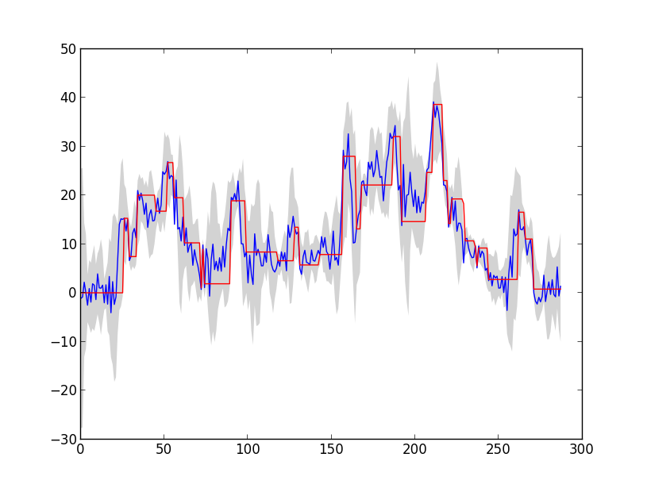

Flip-Flop Filter
=====================

Python implementation of a flip-flop filter as described by: 

Kim, M., & Noble, B. (2001). Mobile network estimation. Proceedings of the 7th annual international conference on Mobile computing and networking (pp. 298–309). New York, NY, USA: ACM. doi:10.1145/381677.381705

Sample of a time series filtered by flip-flop filter. The band around the original time series describes the values of the exponential smoothers. 

